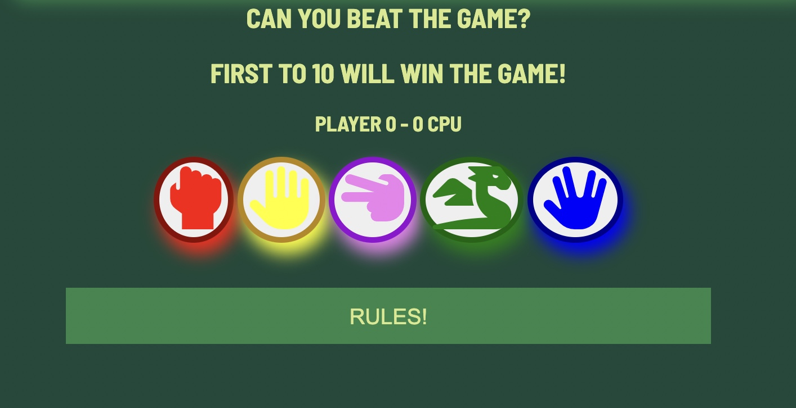
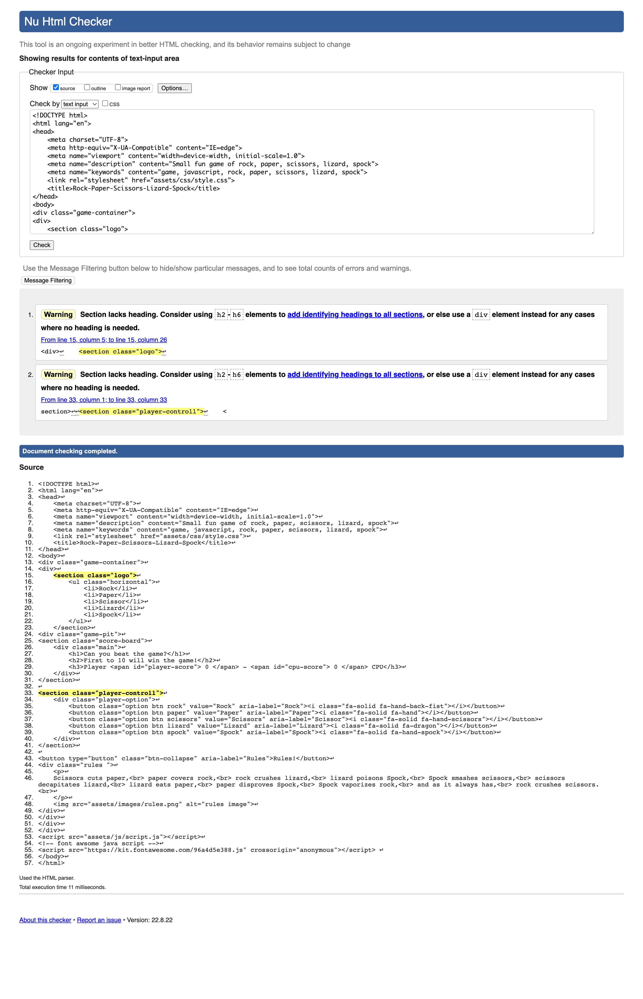

# Rock, paper, scissors, lizard, Spock

A game of Rock, Paper, Scissors, Lizard, Spock made with HTML, CSS and JavaScript.

Try it out [here](https://cbergane.github.io/rock-paper-scissor-lizard-spock/).

## Table of Content

1. [User Experience UX](#user-experience-ux)
    1. [Project Goals](#project-goals)
    2. [Audience Story](#audience-story)
    3. [Color Scheme](#color-scheme)
    4. [Typography](#typography)
    5. [Wireframes](#wireframes)
2. [Featured Design](#featured-design)
    1. [General](#general)
    2. [Game Page](#game-page)
3. [Technologies Used](#technologies-used)
    1. [Languages Used](#languages-used)
    2. [Frameworks, Libraries and Programs Used](#frameworks-libraries-and-programs-used)
4. [Testing](#testing)
        1. [Testing audience stories](#testing-audience-stories)
    2. [Code validation](#code-validation)
    3. [Accessibility](#accessibility)
    4. [Tools Testing](#tools-testing)
    5. [Manual Testing](#manual-testing)
5. [Finished Project](#finished-project)
6. [Deployment](#deployment)
    1. [GitHub Page](#github-page)
7. [Credits](#credits)
    1. [Content](#content)
    2. [Media](#media)
    3. [Code](#code)
8. [Acknowledgments](#acknowledgments)

***

## User Experience UX

### Project Goals

* This website is a simple and short fun game of the classic game "Rock, Paper, Scissors" but with added two more choices.
* You play against the game itself with 5 choices, first to 10 wins will take home the victory.

### Color Scheme

I chose these colors to make a feel like a retro game.

### Typography

For the font, I went for Barlow Semi Condensed, since it felt a bit retro as well and a fallback of Sans-Serif if Barlow isn't loaded correctly.

### Wireframes

[Balsamiq](https://balsamiq.com) was used to build the wireframes to showcase the elements of the site.

Page | Desktop version
--- | ---
Index | 

[Back to top ⇧](#Rock,-paper,-scissors,-lizard,-spock)

## Featured Design

### General

* Responsive design across all platforms and devices.
* Colors match on all platforms.

* **General**

    - The header contains a list with no links, only the game title since this is a one-page site.

* **Game Page**

    - The game container has a quick explanation of the game and the win conditions for the game.
    - Under that, the counter for both the player and the game is displayed.
    - After the scoreboard, there are the player choices for the game, five buttons whit a hover effect on them to make sure the player makes the intended decision.

[Back to top ⇧](#Rock,-paper,-scissors,-lizard,-spock)

## Technologies Used

### Languages Used

* [HTML5](https://en.wikipedia.org/wiki/HTML5)
* [CSS3](https://en.wikipedia.org/wiki/CSS)
* [JS](https://en.wikipedia.org/wiki/Javascript)

### Frameworks Libraries and Programs Used

* [Google Fonts](https://fonts.google.com/)

    - Google Fonts was used to import the font Barlow Semi Condensed into the style.css stylesheet.

* [VS Studio Code](https://code.visualstudio.com)

    - Vs Studio Code was used to write the code and to commit and push content to GitHub.

* [Balsamiq](https://balsamiq.com/)

     - Balsamiq was used to create the wireframes during the design phase of the project.

* [Am I Responsive?](http://ami.responsivedesign.is/#)

    - Am I Responsive was used to see responsive design throughout the process and to generate a mockup image.

* [Chrome DevTools](https://developer.chrome.com/docs/devtools/)

    - Chrome DevTools was used during the development process for code review and to test responsiveness.

* [W3C Markup Validator](https://validator.w3.org/)

    - W3C Markup Validator was used to validate the HTML code.

* [W3C CSS Validator](https://jigsaw.w3.org/css-validator/)

    - W3C CSS Validator was used to validate the CSS code.

* [jshint](https://jshint.com)

    - JSHint was used to validate the JavaScript code.

[Back to top ⇧](#Rock,-paper,-scissors,-lizard,-spock)

## Testing

* When you arrive at the game I want as little confusion as possible for the player. Just start and go.
* If you want to have a look at the rules of the game there is a button to explain them to you.
* The score is visual for the player and what you need to do to win the game.
* The choices buttons clearly with a font awesome icon that explains what the choice will be.

### Code Validation

* The [W3C Markup Validator](https://validator.w3.org/), [W3C CSS Validator](https://jigsaw.w3.org/css-validator), * [jshint](https://jshint.com) were used to validate the site.

    - The [W3C Markup Validator](https://validator.w3.org/) found no errors in my HTML, but two warnings were found but I disregarded them since I used a list to make the main logo.
    
