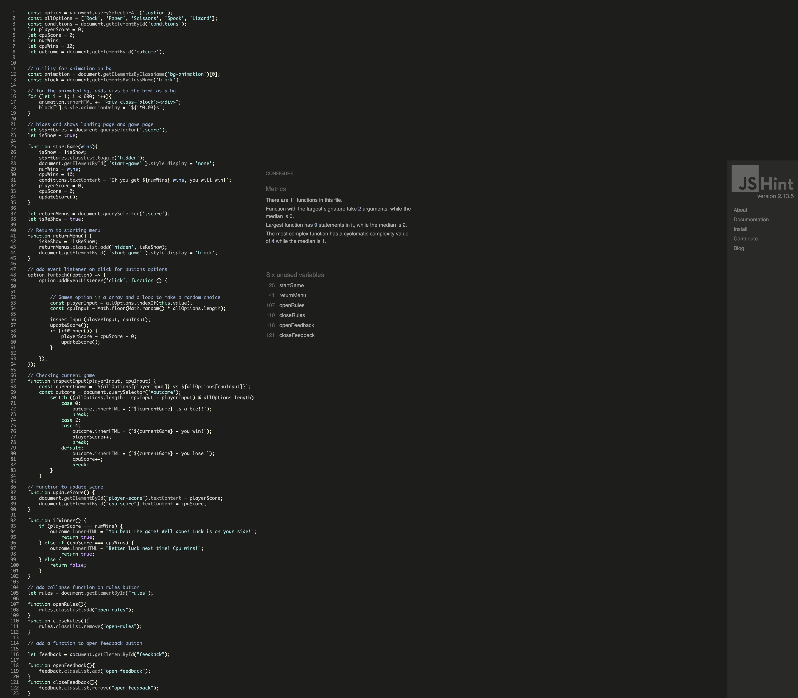
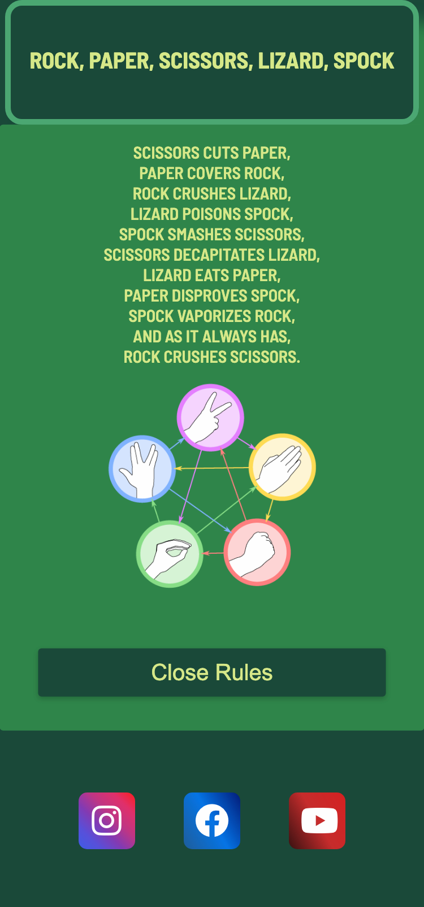

# RPSLS

A game of Rock, Paper, Scissors, Lizard, Spock made with HTML, CSS and JavaScript.

Try it out [here](https://cbergane.github.io/rock-paper-scissor-lizard-spock/).

## Table of Content

1. [User Experience UX](#user-experience-ux)
    1. [Project Goals](#project-goals)
    2. [Audience Story](#audience-story)
    3. [Color Scheme](#color-scheme)
    4. [Typography](#typography)
    5. [Wireframes](#wireframes)
2. [Featured Design](#featured-design)
    1. [General](#general)
    2. [Game Page](#game-page)
3. [Technologies Used](#technologies-used)
    1. [Languages Used](#languages-used)
    2. [Frameworks, Libraries and Programs Used](#frameworks-libraries-and-programs-used)
4. [Testing](#testing)
    1. [Testing audience stories](#testing-audience-stories)
    2. [Code validation](#code-validation)
    3. [Accessibility](#accessibility)
    4. [Manual Testing](#manual-testing)
5. [Finished Project](#finished-project)
6. [Deployment](#deployment)
    1. [GitHub Page](#github-page)
7. [Credits](#credits)
    1. [Content](#content)
    2. [Media](#media)
    3. [Code](#code)
8. [Acknowledgments](#acknowledgments)

***

## User Experience UX

### Project Goals

* This website is a simple and short fun game of the classic game "Rock, Paper, Scissors" but with added two more choices.

* You play against the game itself with 5 choices, you chose a level of difficulty, easy, medium or hard.

### Audience Story

* The player's experience of the site is just to understand what to do easily without explanation.

* If there is any question about the rules there is an easy-to-find button that explains what the rules are.

* If you want to submit any opinions or comments you have a form to fill out.

### Color Scheme

I chose these colors to make a feel like a retro game.

### Typography

For the font, I went for Barlow Semi Condensed, since it felt a bit retro as well and a fallback of Sans-Serif if Barlow isn't loaded correctly.

### Wireframes

[Balsamiq](https://balsamiq.com) was used to build the wireframes to showcase the elements of the site.

Page | Desktop version
--- | ---
Index | 

[Back to top ⇧](#RPSLS)

## Featured Design

### General

* Responsive design across all platforms and devices.
* Colors match on all platforms.

* **General**

    - The header contains a list with no links, only the game title since this is a one-page site.

    - The buttons for rules and the form.

    - Links to social media that opens in a new tab.

* **Game Page**

    - When you land on the page after a short animation loading sequence you are faced with 3 choices of difficulty.

    - A popup div that explains the rules of the game.

    - A popup form if the player has any comments.

    - The game container has a quick explanation of the game and the win conditions for the game.
    - Under that, the counter for both the player and the game is displayed.
    - A button to go back to the choices of difficulty.
    - After the scoreboard, there are the player choices for the game, five buttons whit a hover effect on them to make sure the player makes the intended decision.

[Back to top ⇧](#RPSLS)

## Technologies Used

### Languages Used

* [HTML5](https://en.wikipedia.org/wiki/HTML5)
* [CSS3](https://en.wikipedia.org/wiki/CSS)
* [JS](https://en.wikipedia.org/wiki/Javascript)

### Frameworks Libraries and Programs Used

* [Google Fonts](https://fonts.google.com/)

    - Google Fonts was used to import the font Barlow Semi Condensed into the style.css stylesheet.

* [VS Studio Code](https://code.visualstudio.com)

    - Vs Studio Code was used to write the code and to commit and push content to GitHub.

* [Balsamiq](https://balsamiq.com/)

     - Balsamiq was used to create the wireframes during the design phase of the project.

* [Am I Responsive?](http://ami.responsivedesign.is/#)

    - "Am I Responsive" was used to see responsive design throughout the process and to generate a mockup image.

* [Chrome DevTools](https://developer.chrome.com/docs/devtools/)

    - Chrome DevTools was used during the development process for code review and to test responsiveness.

* [W3C Markup Validator](https://validator.w3.org/)

    - W3C Markup Validator was used to validate the HTML code.

* [W3C CSS Validator](https://jigsaw.w3.org/css-validator/)

    - W3C CSS Validator was used to validate the CSS code.

* [jshint](https://jshint.com)

    - JSHint was used to validate the JavaScript code.

[Back to top ⇧](#RPSLS)

## Testing

### Testing audience stories

* When you arrive at the game I want as little confusion as possible for the player. Just start and go.
* If you want to have a look at the rules of the game there is a button to explain them to you.
* The score is visual for the player and what you need to do to win the game.
* The choices buttons clearly with a font awesome icon that explains what the choice will be.

### Code Validation

* The [W3C Markup Validator](https://validator.w3.org/), [W3C CSS Validator](https://jigsaw.w3.org/css-validator), * [jshint](https://jshint.com) were used to validate the site.

    - The [W3C Markup Validator](https://validator.w3.org/) found no errors in my HTML, but three warnings were found, I disregarded them since they are by choice and have a purpose.
    

    - The [W3C CSS Validator](https://jigsaw.w3.org/css-validator/) found one warning that the import of style sheets won't be reviewed.
    

    - [jshint](https://jshint.com) fond 6 functions, 2 arguments. The largest function has 7 statements, the most complex function has a cyclomatic complexity value of 4.
    

### Accessibility

* Used lighthouse to measure accessibility in Chrome DevTools.
* Lighthouse report

    - Landing page.
    

* Responsiveness

    - [Am I Responsive?](http://ami.responsivedesign.is/#) was used to check the responsiveness of the site pages across different devices.

    - Chrome DevTools was used to test responsiveness in different screen sizes during the development process.

### Manual Testing

* Browser Compatibility

    - The website has been tested on the following browsers:

    **Google Chrome**
        
        No appearance, responsiveness nor functionality issues.
        Tested rules button:
            Expectations:
                - The div will open middle of the screen and be able to close again.
            Outcome:
                - The outcome was as expected.
        The form button has been tested:
            Expectations:
                - The form will open as the rules button and the form will be sent and a successful form dump will open in a new tab.
            Outcome:
                - The outcome was as expected.
        The different difficulty spans were tested on click.
            Expectations:
                - Different win conditions were expected to be displayed in the next div and to hide the landing-page div.
            Outcome:
                - Outcome was as expected.
        The back button was tested:
            Expectations:
                - Hide the score div and reshow the landing-page div again.
            Outcome:
                - Outcome was as expected.
        The player buttons were tested:
            Expectations:
                - That the correct choice was to be displayed and compared with the CPUs choice and deliver an outcome and a correct score will be displayed.
            Outcome:
                - Outcome was as expected.
            

    **Safari**
        
               No appearance, responsiveness nor functionality issues.
        Tested rules button:
            Expectations:
                - The div will open middle of the screen and be able to close again.
            Outcome:
                - The outcome was as expected.
        The form button has been tested:
            Expectations:
                - The form will open as the rules button and the form will be sent and a successful form dump will open in a new tab.
            Outcome:
                - The outcome was as expected.
        The different difficulty spans were tested on click.
            Expectations:
                - Different win conditions were expected to be displayed in the next div and to hide the landing-page div.
            Outcome:
                - Outcome was as expected.
        The back button was tested:
            Expectations:
                - Hide the score div and reshow the landing-page div again.
            Outcome:
                - Outcome was as expected.
        The player buttons were tested:
            Expectations:
                - That the correct choice was to be displayed and compared with the CPUs choice and deliver an outcome and a correct score will be displayed.
            Outcome:
                - Outcome was as expected.

* Device compatibility

    - The website has been tested on the following devices:

    **MacBook Air**

    No appearance, responsiveness nor functionality issues.

    **iPhone 12pro**

    No appearance, responsiveness nor functionality issues.

    **Ipad mini**

    No appearance, responsiveness nor functionality issues.

[Back to top ⇧](#RPSLS)

## Finished Project

Page | Desktop Version | Mobile Version 
--- | --- | ---
Index-pick-lvl |  | 
Index-game |  | 
Index-rules |  | 
Index-form |  | 

[Back to top ⇧](#RPSLS)

## Deployment
* This website was developed using [VS Studio Code](https://code.visualstudio.com), which was then committed and pushed to GitHub using the VS Studio terminal.
### GitHub Page

* I followed these steps to deploy my site on GitHub.
    1. Log in to GitHub and locate the [GitHub Repository](https://github.com/).
    2. At the top of the Repository, locate the Settings button on the menu.
    3. Scroll down the Settings page until you locate the Pages section.
    4. Under Source, click the dropdown called None and select Master Branch.
    5. The page will refresh automatically and generate a link to your website

[Back to top ⇧](#RPSLS)

## Credits

### Content

- All content is written by the developer.

### Media

* [Big bang theory fan page](https://bigbangtheory.fandom.com/wiki/Rock,_Paper,_Scissors,_Lizard,_Spock)
    -  The rule image was taken from a fan page to the Big bang theory show.

* [Favicon](https://www.favicon.cc) 
    - Converted the "rules" image into a favicon from this page.

### Code

* [Love Math](https://codeinstitute.net/) was used as a main source of inspiration for the design of the buttons. [Stack Overflow](https://stackoverflow.com/) was used to understand some concepts of the game and the collapse button. [Competent Programing](https://www.youtube.com/watch?v=lV2BMXdsDmc) for inspiration on the code.

[Back to top ⇧](#RPSLS)

## Acknowledgments

* Code Institute and its amazing Slack community for their support and for providing me with the necessary knowledge to complete this project.

* To my friend Peter Billström who helped me with the code with some pointers and help when I got stuck.

* To my mentor Marcel, who pushed me to do better and bigger.

[Back to top ⇧](#RPSLS)